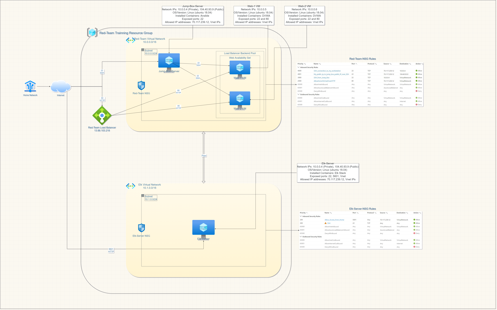
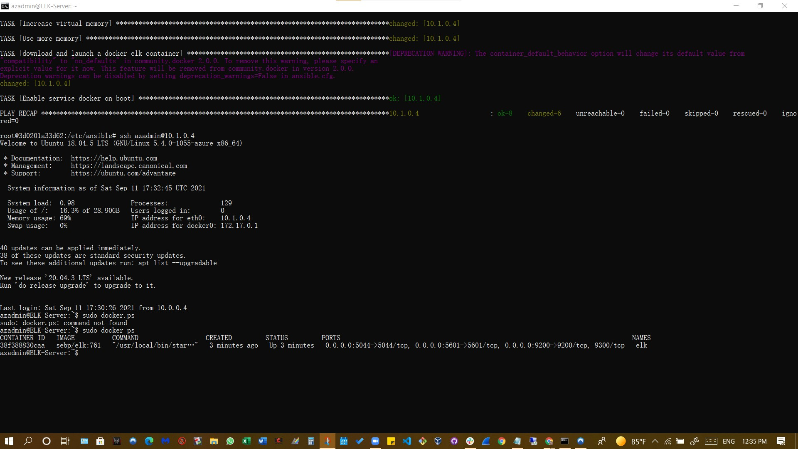

## Automated ELK Stack Deployment

The files in this repository were used to configure the network depicted below.

These files have been tested and used to generate a live ELK deployment on Azure. They can be used to either recreate the entire deployment (pictured above). Alternatively, selected portions of the `YAML` file may be used to install only certain pieces of it, such as Filebeat.

This document contains the following details:
- Description of the Topology
- Access Policies
- ELK Configuration
  - Beats in Use
  - Machines Being Monitored
- How to Use the Ansible Build

### Description of the Topology

The main purpose of this network is to expose a load-balanced and monitored instance of DVWA, the D*mn Vulnerable Web Application.

Load balancing ensures that the application will be highly available and reliable by effectively protecting against distributed denial-of-service (DDoS) attacks through the distribution of treaffic accross all servers within the network, in addition the jump-box restricts access to appoved users to the network.

Integrating an ELK server allows users to easily monitor the vulnerable VMs for changes to the log files in Web-1 and Web-2 using the filebeat software and system metrics and statistics using metricbeat software.

The configuration details of each machine may be found below.

| Name                   | Function | IP Address              | Operating System |
|------------------------|----------|-------------------------|------------------|
| Jump Box Provisioner   | Gateway  | 10.0.0.4, 104.40.93.9   | Linux            |
| Web-1                  |Webserver | 10.0.0.5                | Linux            |
| Web-2                  |Webserver | 10.0.0.6                | Linux            |
| Elk-Server             |Webserver | 10.1.0.4, 137.117.56.188| Linux            |

### Access Policies

The machines on the internal network are not exposed to the public Internet. 

Only the Jump-Box-Provisioner machine can accept connections from the Internet. Access to this machine is only allowed from the following IP addresses: `70.117.239.1`

Machines within the network can only be accessed by Jump-Box-Provisioner `(10.0.0.4)`

A summary of the access policies in place can be found in the table below.

| Name                 | Publicly Accessible | Allowed IP Addresses      |
|----------------------|---------------------|---------------------------|
| Jump Box Provisioner | Yes                 | 70.117.239.1, 10.0.0.0/16 |
| Web-1                | No                  | 10.0.0.0/16               |
| Web-2                | No                  | 10.0.0.0/16               |
| Elk-Server           | Yes                 | 10.1.0.0/16               |

### Elk Configuration

Ansible was used to automate configuration of the ELK machine. No configuration was performed manually, which is advantageous because it allows you to configure multiple machines simultanously. 

The playbook implements the following tasks:

- Intall docker.io using the apt module.
- Install python3-pip using the apt module.
- Install docker module using the pip module.
- Increase virtual memory (command: sysctl -w vm.max_map_count=262144) and use sysctl module to provide the value of desired memory to use.
- Download and launch a docker elk container usin gthe docker_container module.

The following screenshot displays the result of running `docker ps` after successfully configuring the ELK instance.

### Target Machines & Beats
This ELK server is configured to monitor the following machines:

- Web-1 Server `(10.0.0.5)`
- Web-2 Server `(10.0.0.6)`

We have installed the following Beats on these machines:
- Filebeat
- Metricbeat

These Beats allow us to collect the following information from each machine:
- These Beats allow for the collection of data to be analyzed for unespected, potentially malicious activity. For insatace,`Filebeat` collects logfiles which can be used to track unusual behavior within the network. Such behavior may include amount and frequency of failed logins, repeated login attempts within a short period of time by a single user, or unsual/unespeced amount of users logging in simultanously within a specific timeframe. At the same time, `Metricbeat` facilitates the collection of network traffic information, including but not limited to, a rushing outflowing data and the specific types of packets in the traffic, as well as detecting strange connections from foreign IP adresses.

### Using the Playbook
In order to use the playbook, you will need to have an Ansible control node already configured. Assuming you have such a control node provisioned: 

SSH into the control node and follow the steps below:
- Copy the `Elk-playbook.yml` file to `/etc/ansible/roles/install-elk/task`.
- Update the `/ect/asnible/hosts` file to include the groups and specify them with brackets, i.e. [Elk].
- Run the playbook, and navigate to __http://137.117.56.188:5601/app/kibana#/home__ to check that the installation worked as expected.

Use the following command to run, download the playbook, update the files, etc.

 `$ ansible-playbook install-elk.yml`