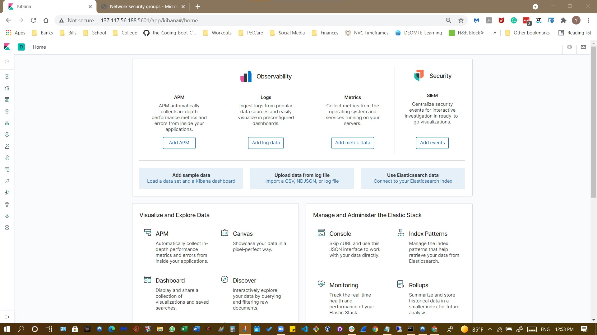
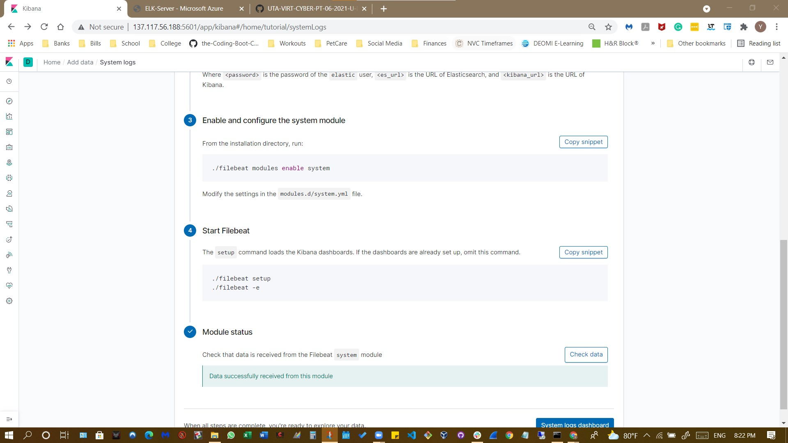
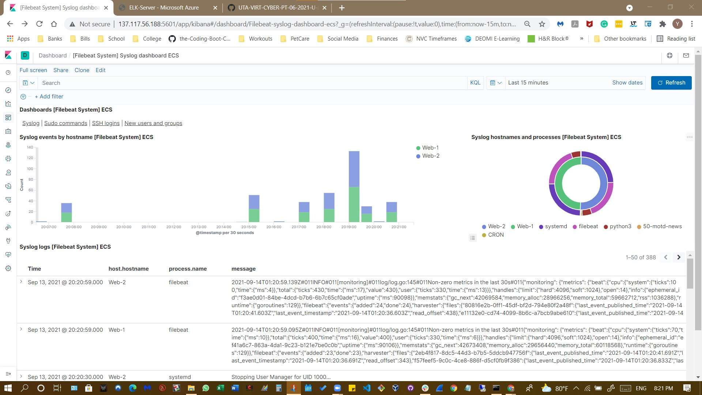
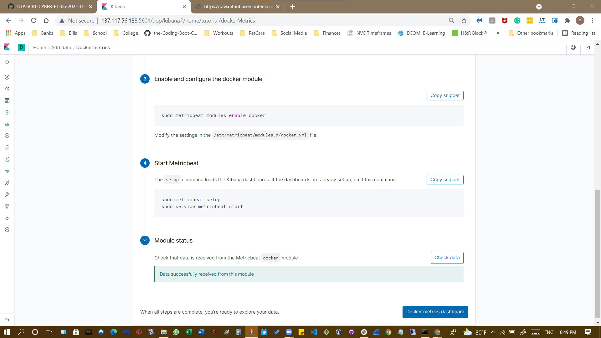
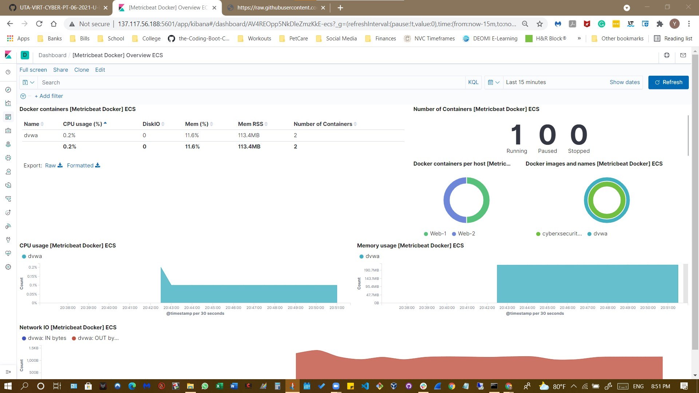

## Automated ELK Stack Deployment

The files in this repository were used to configure the network depicted below.

These files have been tested and used to generate a live ELK deployment on Azure. They can be used to either recreate the entire deployment (pictured above). Alternatively, selected portions of the `YAML` file may be used to install only certain pieces of it, such as Filebeat.

This document contains the following details:
- Description of the Topology
- Access Policies
- ELK Configuration
  - Beats in Use
  - Machines Being Monitored
- How to Use the Ansible Build

### Description of the Topology

The main purpose of this network is to expose a load-balanced and monitored instance of DVWA, the D*mn Vulnerable Web Application.

Load balancing ensures that the application will be highly available and reliable by effectively protecting against distributed denial-of-service (DDoS) attacks through the distribution of traffic across all servers within the network. In addition, the jump-box restricts access to approved users to the network.

Integrating an ELK server allows users to easily monitor the vulnerable VMs for changes to the system log files in Web-1 and Web-2 using the filebeat software and system metrics and statistics using metricbeat software.

The configuration details of each machine may be found below.

| Name                   | Function              | IP Address              | Operating System    |
|------------------------|-----------------------|-------------------------|---------------------|
| Jump Box               |Jump-Box-Provisioner   | 10.0.0.4                | Linux (Ubuntu 18.04)|
| Web-1                  |Webserver              | 10.0.0.5                | Linux (Ubuntu 18.04)|
| Web-2                  |Webserver              | 10.0.0.6                | Linux (Ubuntu 18.04)|
| Elk-Server             |Webserver              | 10.1.0.4                | Linux (Ubuntu 18.04)|
|Red_Team_DVWALB         |Load Balancer          | 13.88.103.218           | N/A                 |

### Access Policies

The machines on the internal network are not exposed to the public Internet. 

Only the Jump-Box-Provisioner machine can accept connections from the Internet. Access to this machine is only allowed from the following IP addresses: `Home Network IP address.`

Machines within the network can only be accessed by Jump-Box-Provisioner `(10.0.0.4)`.

A summary of the access policies in place can be found in the table below.

| Name                 | Publicly Accessible    | Allowed IP Addresses      |
|----------------------|------------------------|---------------------------|
| Jump Box Provisioner | Yes/No                 | 104.40.93.9/10.0.0.4      |
| Web-1                | No/No                  | 13.88.103.218/10.0.0.5    |
| Web-2                | No/No                  | 13.88.103.218/10.0.0.6    |
| Elk-Server           | No/No                  | 137.117.56.188/10.1.0.4   |
| Red_Team_DVWALB      | Yes                    | 13.88.103.218             |

### Elk Configuration

Ansible was used to automate the configuration of the ELK machine. No configuration was performed manually, which is advantageous because it allows you to configure multiple machines simultaneously. 

The playbook implements the following tasks:

- Install docker.io using the apt module.
- Install python3-pip using the apt module.
- Install docker module using the pip module.
- Increase virtual memory (command: `sysctl -w vm.max_map_count=262144`) and use `sysctl` module to provide the value of desired memory to use.
- Download and launch a docker elk container using the `docker_container` module.

The following screenshot displays the result of running `docker ps` after successfully configuring the ELK instance.

### Target Machines & Beats
This ELK server is configured to monitor the following machines:
- Web-1 Server `(10.0.0.5)`
- Web-2 Server `(10.0.0.6)`

We have installed the following Beats on these machines:
- Filebeat
- Metricbeat

These Beats allow us to collect the following information from each machine:
- These Beats allow for the collection of data to be analyzed for unexpected, potentially malicious activity. For instance, `Filebeat` collects log files that can track unusual behavior within the network. Such behavior may include the amount and frequency of failed logins, repeated login attempts within a short period by a single user, or an unusual/unexpected amount of users logging in concurrently within a specific timeframe. Simultaneously, it facilitates the collection of network traffic information, including but not limited to rushing outflowing data and the particular types of packets in the traffic and detecting strange connections from foreign IP addresses. `Metricbeat`, on the other hand, monitors and analyzes the operating system, i.e., CPU, memory, and load, as well as services, such as Apache and MySQL, that are running on the server to collect metric and statistic data periodically and inserts it into Elasticsearch.

### Using the Playbook
To use the playbook, you will need to have an Ansible control node already configured. Assuming you have such a control node provisioned, `SSH` into the control node and follow the steps below:

Install Elk:

- Copy the `Elk-playbook.yml` file to `/etc/ansible/roles/install-elk/task`.

- Update the `/ect/asnible/hosts` file to include the groups and specify them with brackets, i.e. `[Elk]`, and the Elk-Server IP address, i.e. `10.1.0.4` followed by `ansible_python_interpreter=usr/bin/python3`.

- Run the playbook using `$ ansible-playbook Elk-playbook.yml`.

- Navigate to __Kibana__ (http://[elk-server-ip]:5601/app/kibana#/home) to check that the installation worked as expected.

Install Filebeat:

  While in the ansible container:

- Run `curl https://gist.githubusercontent.com/slape/5cc350109583af6cbe577bbcc0710c93/raw/eca603b72586fbe148c11f9c87bf96a63cb25760/Filebeat > /etc/ansible//roles/install-filebeat/files/filebeat-config.yml` to download and save the configuration file.

- Run `nano filebeat-config.yml` to edit the following on the configuration file:

     - Line #1106 (output.elasticsearch):

          - username and password

          - IP address of your elk server leaving the port number (9200).

     - Line #1806 (setup.kibana):
     
          - IP address of your elk server leaving the port number (5601).

-  Save the configuration file.

- Create a playbook file, name it `filebeat-playbook.yml`, and save it under `/etc/ansible/roles/install-filebeat/tasks`.

  The playbook should contain the following tasks:

     - Download the `.deb` file [here](artifacts.elastic.co).

     - Install the `.deb`: `dpkg -i filebeat-7.4.0-amd64.deb`

     - Using the Ansible copy module, copy the entire Filebeat configuration file from the Ansible container to the WebVMs under `/etc/filebeat/filebeat.yml`.

     - Run the following commands:

          - `filebeat modules enable system`
          
          - `filebeat setup`
          
          - `service filebeat start`
          
     - Enable the filebeat service on boot using `systemd`.

 To verify that ELK stack is receiving logs from your DVWA machines, go to the ELK server GUI installation page, scroll to Step 5: Module Status, and click Verify Incoming Data.

Install Metricbeat:

- While in the ansible container:

- Run `curl (https://gist.githubusercontent.com/slape/58541585cc1886d2e26cd8be557ce04c/raw/0ce2c7e744c54513616966affb5e9d96f5e12f73/metricbeat) > /etc/ansible/roles/install-metricbeat/files/metricbeat-config.yml` to download and save the configuration file. 

-  Run `nano metricbeat-config.yml` to edit the following on the configuration file:

     - Line #1106 (output.elasticsearch):

          - username and password

          - IP address of your elk server leaving the port number (9200).

     - Line #1806 (setup.kibana):
     
          - IP address of your elk server leaving the port number (5601).

-  Save the configuration file.

- Create a playbook file, name it `metricbeat-playbook.yml`, and save it under  `/etc/ansible/roles/install-metricbeat/tasks`.

  The playbook should contain the following tasks:

     - Download the `.deb` file [here](https://artifacts.elastic.co/downloads/beats/metricbeat/metricbeat-7.4.0-amd64.deb).

     - Install the `.deb`: `dpkg -i metricbeat-7.4.0-amd64.deb`

     - Using the Ansible copy module, copy the entire Filebeat configuration file from the Ansible container to the WebVMs under `/etc/metricbeat/metricbeat.yml`.

     - Run the following commands:

          - `metricbeat modules enable docker`
          
          - `metricbeat setup`
          
     - Enable the metricbeat service on boot using `systemd`.

 To verify that Metricbeat works as expected, go to the ELK server GUI installation page, scroll to Step 5: Module Status, and click Check Data.

### Bonus: Additional commands
Ansible Commands:

- Command to update host file:
   
     `$ sudo nano /etc/ansible/host/`

- Command to edit configuration files with correct IP addresses and ports:
    
     `sudo nano <name-config file>`

- Command to create a playbook:
    
     `$ nano playbook-name.yml`

- Command to run the playbook:
   
     `$ ansible-playbook <playbook-name.yml>`

- Command to verify that the container is on and get container name:
    
     `$ docker container list -a` 

- Commands to open Ansible container:
    
     `$ sudo docker start <container_name>`
    
     `$ sudo docker attach <container_name>`

Git Commands:

- Command to clone or download a repository:

     - `git clone https://github.com/your-username/yourlink.git`

- Command to sync all items added to the repo (run from desired repo folder in your terminal):

     - `git add .`

- Command to add a single file:

     - `git add <filename>`

- Command to confirm the commit:

     - `git commit -m "Commit message"`

- Command to commit files added with `git add` and changes:

     - `git commit -a`

- Command to check the status of your repository:

     - `git status`

- Command to finalize the sync:

     - `git push`

- Command to update from the remote repository:

     - `git pull`

